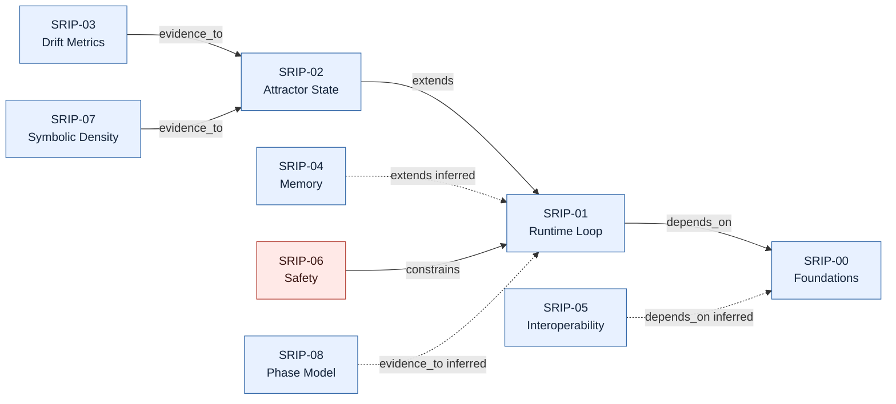
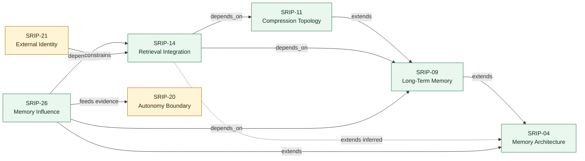
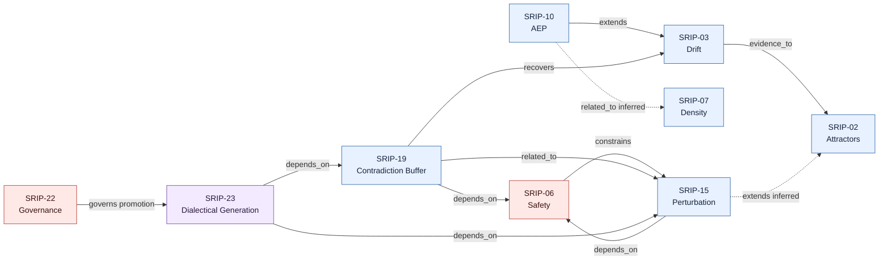
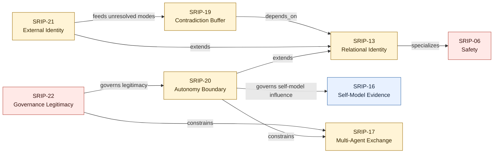
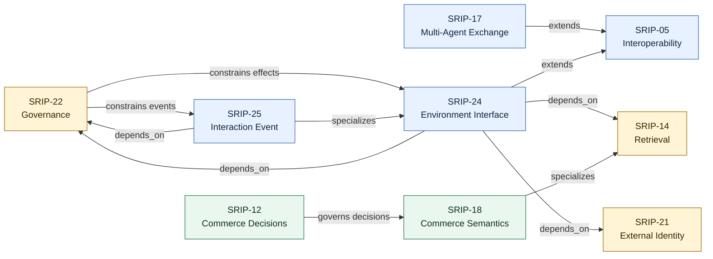

# SRIP Architecture Diagrams

Status: **Non-normative review draft**
Date: 2026-07-17

These diagrams render selected views of `srip-dependency-graph.yaml` using the
evidence classifications in `srip-dependency-reviews.yaml`.

## Reading The Diagrams

- solid arrow: `confirmed` relationship;
- dashed arrow: `inferred` relationship;
- red arrow: `needs_decision` relationship;
- the arrow label states the relationship type;
- diagrams are integration views, not new normative contracts.

The numerical SRIP registry and each proposal's own metadata remain
authoritative.

## 1. Foundational Runtime



Interpretation:

- SRIP-00 and SRIP-01 establish the common runtime frame.
- Attractor, drift, memory, interoperability, density, and phase proposals add
  state or evidence inside that frame.
- SRIP-06 constrains runtime continuation rather than acting as another
  optimization signal.
- Three useful shortcuts are intentionally shown as inferred because their
  direct metadata edges are absent.

## 2. Memory, Retrieval, And Influence



Core separation:

```text
memory exists
    != memory is retrievable
    != memory is relevant
    != memory is authorized to influence current behavior
```

SRIP-14 governs retrieval and injection. SRIP-26 governs the transition from
available memory to behavioral influence. SRIP-20 retains autonomy and
authorization authority.

## 3. Runtime Control, Stability, And Novelty



The dependency review resolved all three previously red relationships: AEP and symbolic density are inferred-related; safety is a direct ADP parent and constraint; RCB interoperates with ADP without requiring it.

Generation is downstream of preserved contradiction. It cannot erase the
contradiction or promote its own candidate to canonical state.

## 4. Identity, Autonomy, And Governance



This view separates three concepts that should not collapse:

1. SRIP-16 observes and proposes;
2. SRIP-20 governs influence on local autonomy and boundary state;
3. SRIP-22 evaluates legitimacy, capture, contestability, and promotion
   authority.

The diagram does not imply that governance can bypass SRIP-06 safety.

## 5. Environment, Events, Multi-Agent Exchange, And Commerce



Two authority rules dominate this view:

- observation of an environment is not authority to create an effect;
- semantic commerce relevance does not override deterministic commerce state.

## Diagram Maintenance Rule

Diagrams must be generated or manually updated from the graph and its review
classifications together. A diagram must not promote an `inferred` or
`needs_decision` relationship to a solid confirmed edge.

When canonical SRIP metadata changes, update in this order:

1. `srip-dependency-graph.yaml`;
2. `srip-dependency-reviews.yaml`;
3. `srip-relationship-audit.md`;
4. this diagram document;
5. the prose synthesis and relationship matrix if their interpretation changed.
